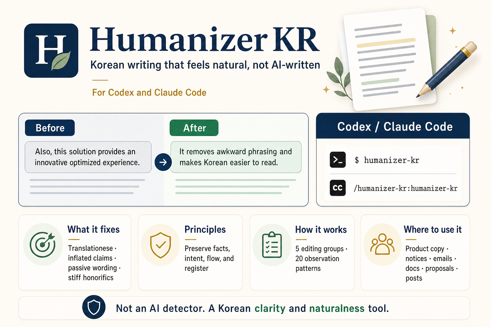

# Humanizer KR

English | [한국어](README.md)

Humanizer KR is a Korean-specialized writing skill for Codex and Claude Code. It rewrites AI-sounding Korean into natural, context-aware Korean while preserving the user's facts, intent, and register.

It is designed for product copy, public notices, emails, documentation, proposals, posts, and other Korean drafts where stiff translationese, inflated claims, or chatbot-like structure make the writing feel less human.



## See the difference first

Humanizer KR does not make Korean copy louder. It removes the padding, inflated claims, and translated-outline rhythm so the reader can understand the point faster. In business contexts, it keeps useful business language instead of flattening everything into plain everyday Korean.

**Before**

> 충분한 물을 마시는 것은 건강한 생활 습관 형성에 도움을 줄 수 있습니다. 또한 이를 통해 몸의 수분 균형을 유지하고 일상생활에서 더 나은 컨디션을 기대할 수 있습니다.

**After**

> 물을 충분히 마시면 몸의 수분 균형을 유지하는 데 도움이 됩니다. 일상에서 컨디션을 관리하기에도 좋습니다.

**After one more quality pass**

> 물을 충분히 마시면 몸의 수분 균형을 유지하는 데 도움이 됩니다. 컨디션 관리에도 좋습니다.

The first rewrite should be safe. The final rewrite should also fit the genre, reader, rhythm, and action. See `examples/evals/output-sample-loop.ko.md` for a sample output-improvement loop.

## When to use it

- Everyday writing or explanatory text feels stiff because of translationese or abstract wording.
- Product copy feels flat, overexplained, or too promotional.
- Notices, emails, and docs are weighed down by ceremonial honorifics.
- Proposals or reports make claims that are larger than the evidence.
- Social posts sound like slogan fragments or chatbot politeness.
- You want Korean output to match a provided writing sample instead of generic polished Korean.

## 5 editing groups, 20 observation patterns

Humanizer KR does not treat the 20 patterns as a flat banned-word list. The skill rewrites through five editing groups, then uses the 20 patterns as Korean-specific observation signals inside those groups.

1. Evidence and claim strength
2. Translationese and vocabulary density
3. Actors and verbs
4. Register and relationship
5. Structure and rhythm

The 20 documented patterns are:

| Group | Patterns |
| --- | --- |
| Evidence and claim strength | inflated praise, vague authority, knowledge-gap disclaimers, generic positive conclusions, stacked hedging |
| Translationese and vocabulary density | translation-like connectors, English-first word choice, synonym cycling |
| Actors and verbs | nominalized Korean, passive or availability chains |
| Register and relationship | register drift, chatbot artifacts, honorific padding, sycophantic or fake-candid openers |
| Structure and rhythm | over-structured chatbot formatting, punctuation and parenthesis clutter, heading warm-ups, bold-label lists, change-anchored documentation, uniform cadence and slogan rhythm |

## What it does

- Rewrites Korean drafts while preserving meaning, facts, paragraph coverage, and register.
- Reviews Korean text for common AI-writing tells such as formulaic praise, stiff translationese, excessive nominalization, repeated passive endings, vague authority claims, and over-structured bullet rhythm.
- Keeps public-facing Korean plain and direct, especially for product copy, announcements, docs, emails, and posts.
- Uses source-grounded vocabulary discipline: do not invent facts, do not force purified words, and check standard or refined terms when wording matters.
- Supports voice calibration from a user-provided Korean writing sample.

## What it is not

Humanizer KR is not an AI detector. The audit script flags patterns that deserve review; it does not prove that a text was written by AI. Do not use this skill to hide plagiarism, impersonate another real person's authorship, or bypass academic, hiring, or compliance integrity checks.

## Install in Codex

### Local plugin install

Use this repository folder as the plugin root. The Codex manifest is:

```text
.codex-plugin/plugin.json
```

After installing or copying the plugin, restart Codex so it reloads the skill metadata. Invoke the skill explicitly with:

```text
Use $humanizer-kr to make this Korean draft sound natural:
[paste text]
```

### Direct skill install

For a personal local install without plugin metadata, copy the skill folder into a Codex skills directory:

```text
skills/humanizer-kr/ -> ~/.codex/skills/humanizer-kr/
```

Restart Codex and invoke `$humanizer-kr`.

### Marketplace publishing

This repository includes `.agents/plugins/marketplace.json` so it can act as a Codex repo marketplace. The marketplace entry points at `plugins/humanizer-kr`, which is the installable plugin package Codex expects. Before publishing, replace every `https://github.com/hjongc/humanizer-kr` placeholder in the manifests and docs with the final repository URL. For public distribution, prefer an immutable tag or commit SHA.

## Install in Claude Code

This repository also includes a Claude Code plugin manifest:

```text
.claude-plugin/plugin.json
```

Add the repository as a Claude Code marketplace, then install the plugin:

```bash
claude plugin marketplace add https://github.com/hjongc/humanizer-kr.git
claude plugin install humanizer-kr@humanizer-kr-marketplace
```

For an immutable install, clone this repository at `v0.1.9` and add the local path:

```bash
git clone --branch v0.1.9 https://github.com/hjongc/humanizer-kr.git
claude plugin marketplace add ./humanizer-kr
claude plugin install humanizer-kr@humanizer-kr-marketplace
```

Depending on the Claude Code version and install path, the skill may be invoked under the plugin namespace, for example:

```text
/humanizer-kr:humanizer-kr
```

Validate the plugin before publishing or debugging local changes:

```bash
claude plugin validate plugins/humanizer-kr
```

## Use

### Rewrite

```text
Use $humanizer-kr to make this Korean draft sound natural:
[paste text]
```

### Rewrite with one quality loop

```text
Use $humanizer-kr. Rewrite this, then review the result once and improve it again:
[paste text]
```

### Review

```text
Use $humanizer-kr to review this Korean copy for AI-like phrasing:
[paste text]
```

### File audit gate

Use the audit helper before publishing Korean files. The basic audit flags AI-writing tells; `--quality` adds a second pass for safe-but-flat wording, weak reader actions, and genre mismatch.

```bash
python3 skills/humanizer-kr/scripts/audit_korean_text.py --quality --genre product-copy --fail-on-findings examples/product-copy.after.ko.md
```

To check every public after example with its genre-specific quality pass, run:

```bash
python3 skills/humanizer-kr/scripts/audit_korean_text.py --after-examples
```

### Voice matching

```text
Use $humanizer-kr. Match this sample voice:
[your Korean writing sample]

Rewrite this:
[draft]
```

## Examples

- `examples/product-copy.before.ko.md` -> `examples/product-copy.after.ko.md`
- `examples/public-notice.before.ko.md` -> `examples/public-notice.after.ko.md`
- `examples/support-email.before.ko.md` -> `examples/support-email.after.ko.md`
- `examples/proposal.before.ko.md` -> `examples/proposal.after.ko.md`
- `examples/docs.before.ko.md` -> `examples/docs.after.ko.md`
- `examples/social-post.before.ko.md` -> `examples/social-post.after.ko.md`

The after examples include multiple rewrite candidates such as a safe version, a warmer version, and a shorter version. They are reference rewrites, not the only acceptable answers.

## Source basis

See `skills/humanizer-kr/references/korean-source-rules.md` for the trusted Korean source map and how the skill uses each source.

Use `skills/humanizer-kr/references/rewriting-playbook.md` for pattern-specific rewrite strategies and over-editing guardrails.

## Limitations

- The skill improves wording and register; it does not verify factual claims unless the user provides sources.
- The audit script is conservative and pattern-based. Clean output does not guarantee polished Korean.
- Claude Code plugin behavior can vary by installed Claude Code version. Validate locally before publishing to a Claude marketplace.

## License

MIT
